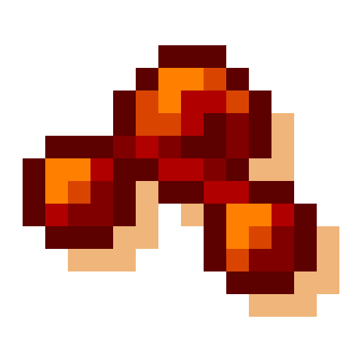

# Visuality: Reforged

## About

Visuality: Reforged is an unofficial Forge port for [Visuality](https://www.curseforge.com/minecraft/mc-mods/visuality), please support the original work.

This is a simple client-sided cosmetic mod that will add a bunch of new particles such as crystal sparkles, particles on mob hitting, custom blob particles for slimes, environmental particles to your Minecraft world.

Expect particles collection expanding with the mod updates!

## Configuration

You can configure the mod by editing visuality-client.toml in the config folder of your Minecraft directory or use [Configured](https://www.curseforge.com/minecraft/mc-mods/configured) for in-game config UI.

## Feedback

All feature requests should go to [Visuality](https://github.com/PinkGoosik/visuality).

All bug reports on Forge should go to Visuality: Reforged.
